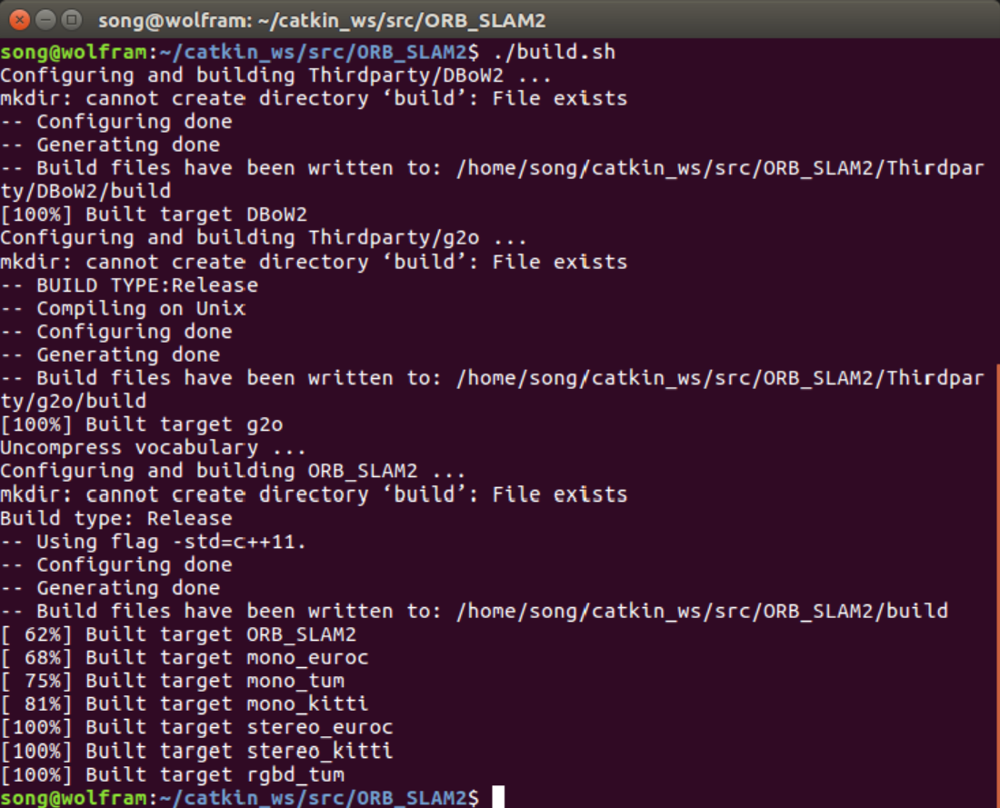
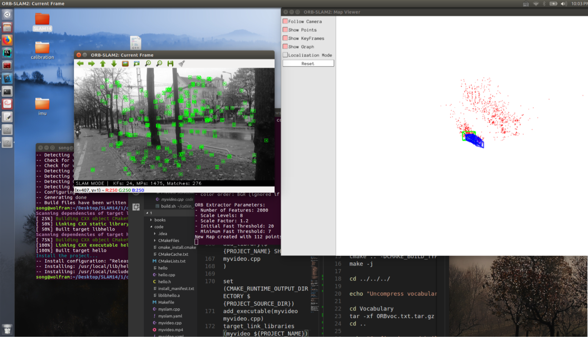

# 深蓝学院SLAM第1讲作业  yvonshong

# Linux

## 1. Ubuntu software
```
sudo apt-get install package_name
```

The softwares are installed in the directory as `/bin/` .


## 2. Linux environment variables
Linux environment variables are the commands that you can setup everywhere instead of assigning the pathes of the softwares.

We use the command like `export VARNAME="myValue"` to add the varialbes to `/etc/environment`

## 3. Root directory structure
`/bin` - the directory for the commands and softwares in common use.

`/boot` - the directory for LInux setup files and kernel.

`/dev` - the directory for the devices connected with the computer.

`/home` - the directory for the data of users.

`/usr` - the softwares and files for each user.

`/lib` - the directory for system dynamic link shared libraries.

`/tmp` - the directory for temp data.

`/media`

`/sbin`

`/var`

`/root`

`/opt`

`/sbin`

`/mnt`


## 4.Add executable authority to a file

`chmod +x a.sh`

## 5. Change the owner of a file
`chown xiang:xiang a.sh`
# SLAM
## 1. SLAM scenes
- Indoor sweep robot
- AV/MR
- Autonomous car
- Unmanned Aerial Vehicle


## 2. The relationship between location and mapping
We could use map to get the exact estimation of location. And use the location to form the map.

So we need map to store the old locations and use them to improve the new estimation, like local BA and loop closure.

## 3. History of SLAM

1. Filter

2. Keyframe based Buddle Adjustmen 

3. Directly tracking 


## 4. Classical references in SLAM field
1. Klein G, Murray D. Parallel tracking and mapping for small AR workspaces[C]//Mixed and Augmented Reality, 2007. ISMAR 2007. 6th IEEE and ACM International Symposium on. IEEE, 2007: 225-234.

2. Davison A J, Reid I D, Molton N D, et al. MonoSLAM: Real-time single camera SLAM[J]. IEEE transactions on pattern analysis and machine intelligence, 2007, 29(6): 1052-1067.

3. Mur-Artal R, Montiel J M M, Tardos J D. ORB-SLAM: a versatile and accurate monocular SLAM system[J]. IEEE Transactions on Robotics, 2015, 31(5): 1147-1163.

# CMake
```txt
cmake_minimum_required(VERSION 2.8.3)
project(sayhello)
set(CMAKE_BUILD_TYPE "Release")

add_library(libhello hello.cpp)
add_executable(hello useHello.cpp)

target_link_libraries(hello libhello)

install(TARGETS hello DESTINATION /usr/local/lib)
install(FILES hello.h DESTINATION /usr/local/include)

target_link_libraries(hello libhello)


```


# ORB-SLAM2
## 1. git clone 


## 2. build
### a. 
After compilation, it creates `/build` and `/lib`

some executable binary files:
- `rgbd_tum`
- `stereo_kitti`
- `stereo_euroc`
- `mono_tum`
- `mono_kitti`
- `mono_euroc`

Library:
- `src/System.cc`
- `src/Tracking.cc`
- `src/LocalMapping.cc`
- `src/LoopClosing.cc`
- `src/ORBextractor.cc`
- `src/ORBmatcher.cc`
- `src/FrameDrawer.cc`
- `src/Converter.cc`
- `src/MapPoint.cc`
- `src/KeyFrame.cc`
- `src/Map.cc`
- `src/MapDrawer.cc`
- `src/Optimizer.cc`
- `src/PnPsolver.cc`
- `src/Frame.cc`
- `src/KeyFrameDatabase.cc`
- `src/Sim3Solver.cc`
- `src/Initializer.cc`
- `src/Viewer.cc`


### b.
`include` - the head files

`Example` - the demo of Mono/Steoro/RGBD/ROS ORB-SLAM2

`src` - the source code of ORB-SLAM2 


### C.

All are linked to `libORB_SLAM2` library.

## 3. linked libraries


# RUN ORB-SLAM2
## 1. build



## 2. CMakeLists.txt


1. move `myvideo.cpp` to `ORB_SLAM2/`

add to old  `CMakeLists.txt`

```
add_library(${PROJECT_NAME} SHARED
myvideo.cpp
)

set(CMAKE_RUNTIME_OUTPUT_DIRECTORY ${PROJECT_SOURCE_DIR})
add_executable(myvideo myvideo.cpp)
target_link_libraries(myvideo ${PROJECT_NAME})
```

## 3. run



