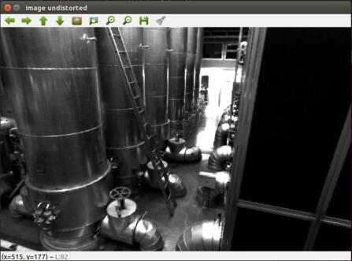

# 深蓝学院-SLAM第4课作业-yvonshong

# 图像去畸变

```cpp
double x = (u -cx)/fx;
double y = (v -cy)/fy;
double r2= pow(x,2)+pow(y,2);
double r4= pow(r2,2);
double x_distorted = x*(1+k1*r2+k2*r4)+2*p1*x*y+p2*(r2+2*x*x);
double y_distorted = y*(1+k1*r2+k2*r4)+p1*(r2+2*y*y)+2*p2*x*y;
u_distorted = x_distorted*fx+cx;
v_distorted = y_distorted*fy+cy;
```




# 双目视差的使用

```cpp
double dis = disparity.at<uchar>(v, u);
double z = fx * d / dis;
double x = z * (u - cx) / fx;
double y = z * (v - cy) / fy;
point(0) = x;
point(1) = y;
point(2) = z;
pointcloud.push_back(point);
```


# 矩阵微分


# 高斯牛顿法的曲线拟合实验


