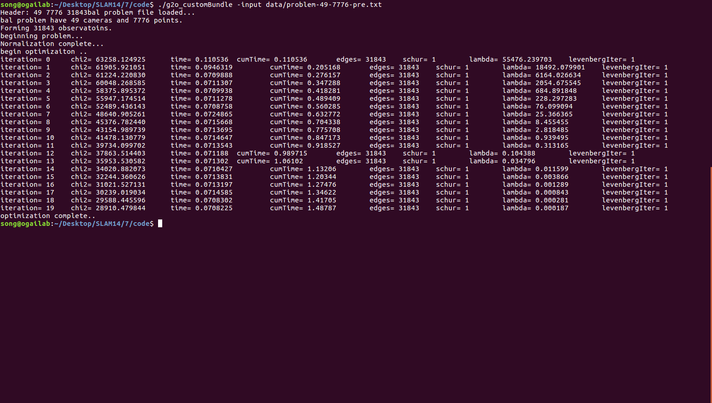

# 深蓝学院-SLAM第7课作业-yvonshong


# Bundle Adjustment 

## 文献阅读

### 为何说 Bundle Adjustment is slow 是不对的？ 

因为BA具有稀疏性，可以利用BA的特殊结构加速和稀疏优化。

### BA 中有哪些需要注意参数化的地⽅？Pose 和 Point 各有哪些参数化⽅式？有何优缺点。 

 Depending on how the entities that it contains are represented, x can be subject to various types of complications including singularities, internal constraints, and unwanted internal degrees of freedom. 

**point**：  use a homogeneous parametrization $(X ,Y ,Z ,W)^T$ for distant points, e.g. with spherical normalization $\Sigma X_i^2=1$  .

( large $ X,Y,Z$ displacements are needed to change the image significantly. I.e., in $(X Y Z)$ space the cost function becomes very flat and steps needed for cost adjustment become very large for distant points. )

**rotation**: use  either quaternions subject to $||q||^2=1$  , or local perturbations $R δR$ or $δRR$ of an existing rotation $R$ .

(Euler angles cause numerical problems )

### 本⽂写于 2000 年，但是⽂中提到的很多内容在后⾯⼗⼏年的研究中得到了印证。你能看到哪些 ⽅向在后续⼯作中有所体现？请举例说明。

BA在后端部分成为主流优化方法。

物体检测。

## BAL-dataset

```cpp
#include <Eigen/StdVector>
#include <Eigen/Core>

#include <iostream>
#include <stdint.h>

#include <unordered_set>
#include <memory>
#include <vector>
#include <stdlib.h> 

#include "g2o/stuff/sampler.h"
#include "g2o/core/sparse_optimizer.h"
#include "g2o/core/block_solver.h"
#include "g2o/core/solver.h"
#include "g2o/core/robust_kernel_impl.h"
#include "g2o/core/batch_stats.h"
#include "g2o/core/optimization_algorithm_levenberg.h"
#include "g2o/core/optimization_algorithm_dogleg.h"

#include "g2o/solvers/cholmod/linear_solver_cholmod.h"
#include "g2o/solvers/dense/linear_solver_dense.h"
#include "g2o/solvers/eigen/linear_solver_eigen.h"
#include "g2o/solvers/pcg/linear_solver_pcg.h"
#include "g2o/types/sba/types_six_dof_expmap.h"

#include "g2o/solvers/structure_only/structure_only_solver.h"

#include "common/BundleParams.h"
#include "common/BALProblem.h"
#include "g2o_bal_class.h"


using namespace Eigen;
using namespace std;

typedef Eigen::Map<Eigen::VectorXd> VectorRef;
typedef Eigen::Map<const Eigen::VectorXd> ConstVectorRef;
typedef g2o::BlockSolver<g2o::BlockSolverTraits<9,3> > BalBlockSolver;

// set up the vertexs and edges for the bundle adjustment. 
void BuildProblem(const BALProblem* bal_problem, g2o::SparseOptimizer* optimizer, const BundleParams& params)
{
    const int num_points = bal_problem->num_points();
    const int num_cameras = bal_problem->num_cameras();
    const int camera_block_size = bal_problem->camera_block_size();
    const int point_block_size = bal_problem->point_block_size();

    // Set camera vertex with initial value in the dataset.
    const double* raw_cameras = bal_problem->cameras();
    for(int i = 0; i < num_cameras; ++i)
    {
        ConstVectorRef temVecCamera(raw_cameras + camera_block_size * i,camera_block_size);
        VertexCameraBAL* pCamera = new VertexCameraBAL();
        pCamera->setEstimate(temVecCamera);   // initial value for the camera i..
        pCamera->setId(i);                    // set id for each camera vertex 
  
        // remeber to add vertex into optimizer..
        optimizer->addVertex(pCamera);
        
    }

    // Set point vertex with initial value in the dataset. 
    const double* raw_points = bal_problem->points();
    // const int point_block_size = bal_problem->point_block_size();
    for(int j = 0; j < num_points; ++j)
    {
        ConstVectorRef temVecPoint(raw_points + point_block_size * j, point_block_size);
        VertexPointBAL* pPoint = new VertexPointBAL();
        pPoint->setEstimate(temVecPoint);   // initial value for the point i..
        pPoint->setId(j + num_cameras);     // each vertex should have an unique id, no matter it is a camera vertex, or a point vertex 

        // remeber to add vertex into optimizer..
        pPoint->setMarginalized(true);
        optimizer->addVertex(pPoint);
    }

    // Set edges for graph..
    const int  num_observations = bal_problem->num_observations();
    const double* observations = bal_problem->observations();   // pointer for the first observation..

    for(int i = 0; i < num_observations; ++i)
    {
        EdgeObservationBAL* bal_edge = new EdgeObservationBAL();

        const int camera_id = bal_problem->camera_index()[i]; // get id for the camera; 
        const int point_id = bal_problem->point_index()[i] + num_cameras; // get id for the point 
        
        if(params.robustify)
        {
            g2o::RobustKernelHuber* rk = new g2o::RobustKernelHuber;
            rk->setDelta(1.0);
            bal_edge->setRobustKernel(rk);
        }
        // set the vertex by the ids for an edge observation
        bal_edge->setVertex(0,dynamic_cast<VertexCameraBAL*>(optimizer->vertex(camera_id)));
        bal_edge->setVertex(1,dynamic_cast<VertexPointBAL*>(optimizer->vertex(point_id)));
        bal_edge->setInformation(Eigen::Matrix2d::Identity());
        bal_edge->setMeasurement(Eigen::Vector2d(observations[2*i+0],observations[2*i + 1]));

       optimizer->addEdge(bal_edge) ;
    }

}

void WriteToBALProblem(BALProblem* bal_problem, g2o::SparseOptimizer* optimizer)
{
    const int num_points = bal_problem->num_points();
    const int num_cameras = bal_problem->num_cameras();
    const int camera_block_size = bal_problem->camera_block_size();
    const int point_block_size = bal_problem->point_block_size();

    double* raw_cameras = bal_problem->mutable_cameras();
    for(int i = 0; i < num_cameras; ++i)
    {
        VertexCameraBAL* pCamera = dynamic_cast<VertexCameraBAL*>(optimizer->vertex(i));
        Eigen::VectorXd NewCameraVec = pCamera->estimate();
        memcpy(raw_cameras + i * camera_block_size, NewCameraVec.data(), sizeof(double) * camera_block_size);
    }

    double* raw_points = bal_problem->mutable_points();
    for(int j = 0; j < num_points; ++j)
    {
        VertexPointBAL* pPoint = dynamic_cast<VertexPointBAL*>(optimizer->vertex(j + num_cameras));
        Eigen::Vector3d NewPointVec = pPoint->estimate();
        memcpy(raw_points + j * point_block_size, NewPointVec.data(), sizeof(double) * point_block_size);
    }
}

//this function is  unused yet..
void SetMinimizerOptions(std::shared_ptr<BalBlockSolver>& solver_ptr, const BundleParams& params, g2o::SparseOptimizer* optimizer)
{
    //std::cout<<"Set Minimizer  .."<< std::endl;
    g2o::OptimizationAlgorithmWithHessian* solver;
    if(params.trust_region_strategy == "levenberg_marquardt"){
        solver = new g2o::OptimizationAlgorithmLevenberg(solver_ptr.get());
    }
    else if(params.trust_region_strategy == "dogleg"){
        solver = new g2o::OptimizationAlgorithmDogleg(solver_ptr.get());
    }
    else 
    {
        std::cout << "Please check your trust_region_strategy parameter again.."<< std::endl;
        exit(EXIT_FAILURE);
    }

    optimizer->setAlgorithm(solver);
    //std::cout<<"Set Minimizer  .."<< std::endl;
}

//this function is  unused yet..
void SetLinearSolver(std::shared_ptr<BalBlockSolver>& solver_ptr, const BundleParams& params)
{
    //std::cout<<"Set Linear Solver .."<< std::endl;
    g2o::LinearSolver<BalBlockSolver::PoseMatrixType>* linearSolver = 0;
    
    if(params.linear_solver == "dense_schur" ){
        linearSolver = new g2o::LinearSolverDense<BalBlockSolver::PoseMatrixType>();
    }
    else if(params.linear_solver == "sparse_schur"){
        linearSolver = new g2o::LinearSolverCholmod<BalBlockSolver::PoseMatrixType>();
        dynamic_cast<g2o::LinearSolverCholmod<BalBlockSolver::PoseMatrixType>* >(linearSolver)->setBlockOrdering(true);  // AMD ordering , only needed for sparse cholesky solver
    }
    

    solver_ptr = std::make_shared<BalBlockSolver>(linearSolver);
    std::cout <<  "Set Complete.."<< std::endl;
}

void SetSolverOptionsFromFlags(BALProblem* bal_problem, const BundleParams& params, g2o::SparseOptimizer* optimizer)
{   
    BalBlockSolver* solver_ptr;
    
    
    g2o::LinearSolver<BalBlockSolver::PoseMatrixType>* linearSolver = 0;
    
    if(params.linear_solver == "dense_schur" ){
        linearSolver = new g2o::LinearSolverDense<BalBlockSolver::PoseMatrixType>();
    }
    else if(params.linear_solver == "sparse_schur"){
        linearSolver = new g2o::LinearSolverCholmod<BalBlockSolver::PoseMatrixType>();
        dynamic_cast<g2o::LinearSolverCholmod<BalBlockSolver::PoseMatrixType>* >(linearSolver)->setBlockOrdering(true);  // AMD ordering , only needed for sparse cholesky solver
    }
    

    solver_ptr = new BalBlockSolver(linearSolver);
    //SetLinearSolver(solver_ptr, params);

    //SetMinimizerOptions(solver_ptr, params, optimizer);
    g2o::OptimizationAlgorithmWithHessian* solver;
    if(params.trust_region_strategy == "levenberg_marquardt"){
        solver = new g2o::OptimizationAlgorithmLevenberg(solver_ptr);
    }
    else if(params.trust_region_strategy == "dogleg"){
        solver = new g2o::OptimizationAlgorithmDogleg(solver_ptr);
    }
    else 
    {
        std::cout << "Please check your trust_region_strategy parameter again.."<< std::endl;
        exit(EXIT_FAILURE);
    }

    optimizer->setAlgorithm(solver);
}


void SolveProblem(const char* filename, const BundleParams& params)
{
    BALProblem bal_problem(filename);

    // show some information here ...
    std::cout << "bal problem file loaded..." << std::endl;
    std::cout << "bal problem have " << bal_problem.num_cameras() << " cameras and "
              << bal_problem.num_points() << " points. " << std::endl;
    std::cout << "Forming " << bal_problem.num_observations() << " observatoins. " << std::endl;

    // store the initial 3D cloud points and camera pose..
    if(!params.initial_ply.empty()){
        bal_problem.WriteToPLYFile(params.initial_ply);
    }

    std::cout << "beginning problem..." << std::endl;
    
    // add some noise for the intial value
    srand(params.random_seed);
    bal_problem.Normalize();
    bal_problem.Perturb(params.rotation_sigma, params.translation_sigma,
                        params.point_sigma);

    std::cout << "Normalization complete..." << std::endl;


    g2o::SparseOptimizer optimizer;
    SetSolverOptionsFromFlags(&bal_problem, params, &optimizer);
    BuildProblem(&bal_problem, &optimizer, params);

    
    std::cout << "begin optimizaiton .."<< std::endl;
    // perform the optimizaiton 
    optimizer.initializeOptimization();
    optimizer.setVerbose(true);
    optimizer.optimize(params.num_iterations);

    std::cout << "optimization complete.. "<< std::endl;
    // write the optimized data into BALProblem class
    WriteToBALProblem(&bal_problem, &optimizer);

    // write the result into a .ply file.
    if(!params.final_ply.empty()){
        bal_problem.WriteToPLYFile(params.final_ply);
    }
   
}

int main(int argc, char** argv)
{
    
    BundleParams params(argc,argv);  // set the parameters here.

    if(params.input.empty()){
        std::cout << "Usage: bundle_adjuster -input <path for dataset>";
        return 1;
    }

    SolveProblem(params.input.c_str(), params);
  
    return 0;
}


```





# 直接法的 Bundle Adjustment 

## 数学模型

### 如何描述任意⼀点投影在任意⼀图像中形成的 error？ 

像素值差

$\begin{equation} e = {\mathbf{I}_1}\left( {{\mathbf{p}_1}} \right) - {\mathbf{I}_2}\left( {{\mathbf{p}_2}} \right) \end{equation}$

### 每个 error 关联⼏个优化变量？ 

变量为一个相机位姿，一个位姿顶点

### error 关于各变量的雅可⽐是什么？

$  \frac{{\partial \mathbf{u}}}{{\partial \delta \mathbf{\xi} }} = \left[ {\begin{array}{*{20}{c}} {\frac{{{f_x}}}{Z}}&0&{ - \frac{{{f_x}X}}{{{Z^2}}}}&{ - \frac{{{f_x}XY}}{{{Z^2}}}}&{{f_x} + \frac{{{f_x}{X^2}}}{{{Z^2}}}}&{ - \frac{{{f_x}Y}}{Z}}\\ 0&{\frac{{{f_y}}}{Z}}&{ - \frac{{{f_y}Y}}{{{Z^2}}}}&{ - {f_y} - \frac{{{f_y}{Y^2}}}{{{Z^2}}}}&{\frac{{{f_y}XY}}{{{Z^2}}}}&{\frac{{{f_y}X}}{Z}} \end{array}} \right]  $

$ \mathbf{J} = - \frac{{\partial { \mathbf{I}_2}}}{{\partial \mathbf{u}}}\frac{{\partial \mathbf{u}}}{{\partial \delta \mathbf{\xi} }} $


## 实现

### 能否不要以 $[x,y,z]^T$ 的形式参数化每个点？ 

可以把像素值也直接作为参数

### 取 4x4 的 patch 好吗？取更⼤的 patch 好还是取⼩⼀点的 patch 好？  

取大一点比较好，减少误差。

### 从本题中，你看到直接法与特征点法在 BA 阶段有何不同？  

cost function不同，直接法是像素差，特征点法是重投影。

### 由于图像的差异，你可能需要鲁棒核函数，例如 Huber。此时 Huber 的阈值如何选取？ 

取决于系统的鲁棒性要求，鲁棒性越强，阈值越低，对误差越包容。


```cpp
#include <iostream>
using namespace std;
#include <g2o/core/base_unary_edge.h>
#include <g2o/core/base_binary_edge.h>
#include <g2o/core/base_vertex.h>
#include <g2o/core/block_solver.h>
#include <g2o/core/optimization_algorithm_levenberg.h>
#include <g2o/solvers/dense/linear_solver_dense.h>
#include <g2o/core/robust_kernel.h>
#include <g2o/core/robust_kernel_impl.h>
#include <g2o/types/sba/types_six_dof_expmap.h>
#include <Eigen/Core>
#include <sophus/se3.h>
#include <opencv2/opencv.hpp>
#include <pangolin/pangolin.h>
#include <boost/format.hpp>

typedef vector<Sophus::SE3, Eigen::aligned_allocator<Sophus::SE3>> VecSE3;
typedef vector<Eigen::Vector3d, Eigen::aligned_allocator<Eigen::Vector3d>> VecVec3d;

// global variables
string pose_file = "./poses.txt";
string points_file = "./points.txt";

// intrinsics
float fx = 277.34;
float fy = 291.402;
float cx = 312.234;
float cy = 239.777;

// bilinear interpolation
inline float GetPixelValue(const cv::Mat &img, float x, float y)
{
    uchar *data = &img.data[int(y) * img.step + int(x)];
    float xx = x - floor(x);
    float yy = y - floor(y);
    return float(
        (1 - xx) * (1 - yy) * data[0] +
        xx * (1 - yy) * data[1] +
        (1 - xx) * yy * data[img.step] +
        xx * yy * data[img.step + 1]);
}

// g2o vertex that use sophus::SE3 as pose
class VertexSophus : public g2o::BaseVertex<6, Sophus::SE3>
{
  public:
    EIGEN_MAKE_ALIGNED_OPERATOR_NEW

    VertexSophus() {}

    ~VertexSophus() {}

    bool read(std::istream &is) {}

    bool write(std::ostream &os) const {}

    virtual void setToOriginImpl()
    {
        _estimate = Sophus::SE3();
    }

    virtual void oplusImpl(const double *update_)
    {
        Eigen::Map<const Eigen::Matrix<double, 6, 1>> update(update_);
        //        cout << update.transpose() << endl;
        setEstimate(Sophus::SE3::exp(update) * estimate());
    }
};

// TODO edge of projection error, implement it
// 16x1 error, which is the errors in patch
typedef Eigen::Matrix<double, 16, 1> Vector16d;
class EdgeDirectProjection : public g2o::BaseBinaryEdge<16, Vector16d, g2o::VertexSBAPointXYZ, VertexSophus>
{
  public:
    EIGEN_MAKE_ALIGNED_OPERATOR_NEW;

    EdgeDirectProjection(float *color, cv::Mat &target)
    {
        this->origColor = color;
        this->targetImg = target;
    }

    ~EdgeDirectProjection() {}

    virtual void computeError() override
    {
        // TODO START YOUR CODE HERE
        // compute projection error ...

        const g2o::VertexSBAPointXYZ *Point_vertex = static_cast<const g2o::VertexSBAPointXYZ *>(vertex(0));
        const VertexSophus *pose_vertex = static_cast<const VertexSophus *>(vertex(1));

        const g2o::Vector3D Point = Point_vertex->estimate();
        const Sophus::SE3 pose = pose_vertex->estimate();

        g2o::Vector3D camera_Point = pose * Point;
        Eigen::Vector2d pixel;
        pixel(0) = fx * camera_Point(0) / camera_Point(2) + cx;
        pixel(1) = fy * camera_Point(1) / camera_Point(2) + cy;

        if (pixel(0) < 4 || pixel(0) > targetImg.cols - 4 || pixel(1) < 4 || pixel(1) > targetImg.rows - 4)
        {
            for (int k = 0; k < 16; k++)
            {
                _error(k, 0) = 0.0;
            }
            this->setLevel(1);
        }
        else
        {
            int i = 0;
            for (int x = -2; x <= 1; x++)
            {
                for (int y = -2; y <= 1; y++)
                {
                    _error(i, 0) = origColor[i] - GetPixelValue(targetImg, pixel(0) + x, pixel(1) + y);
                    i++;
                }
          
        }

        // END YOUR CODE HERE
    }

    // Let g2o compute jacobian for you

    virtual bool read(istream &in) {}

    virtual bool write(ostream &out) const {}

  private:
    cv::Mat targetImg;          // the target image
    float *origColor = nullptr; // 16 floats, the color of this point
};

// plot the poses and points for you, need pangolin
void Draw(const VecSE3 &poses, const VecVec3d &points);

int main(int argc, char **argv)
{

    // read poses and points
    VecSE3 poses;
    VecVec3d points;
    ifstream fin(pose_file);

    while (!fin.eof())
    {
        double timestamp = 0;
        fin >> timestamp;
        if (timestamp == 0)
            break;
        double data[7];
        for (auto &d : data)
            fin >> d;
        poses.push_back(Sophus::SE3(
            Eigen::Quaterniond(data[6], data[3], data[4], data[5]),
            Eigen::Vector3d(data[0], data[1], data[2])));
        if (!fin.good())
            break;
    }
    fin.close();

    vector<float *> color;
    fin.open(points_file);
    while (!fin.eof())
    {
        double xyz[3] = {0};
        for (int i = 0; i < 3; i++)
            fin >> xyz[i];
        if (xyz[0] == 0)
            break;
        points.push_back(Eigen::Vector3d(xyz[0], xyz[1], xyz[2]));
        float *c = new float[16];
        for (int i = 0; i < 16; i++)
            fin >> c[i];
        color.push_back(c);

        if (fin.good() == false)
            break;
    }
    fin.close();

    cout << "poses: " << poses.size() << ", points: " << points.size() << endl;

    // read images
    vector<cv::Mat> images;
    boost::format fmt("./%d.png");
    for (int i = 0; i < 7; i++)
    {
        images.push_back(cv::imread((fmt % i).str(), 0));
    }

    // build optimization problem
    typedef g2o::BlockSolver<g2o::BlockSolverTraits<6, 3>> DirectBlock; // 求解的向量是6＊1的
    DirectBlock::LinearSolverType *linearSolver = new g2o::LinearSolverDense<DirectBlock::PoseMatrixType>();
    DirectBlock *solver_ptr = new DirectBlock(linearSolver);
    g2o::OptimizationAlgorithmLevenberg *solver = new g2o::OptimizationAlgorithmLevenberg(solver_ptr); // L-M
    g2o::SparseOptimizer optimizer;
    optimizer.setAlgorithm(solver);
    optimizer.setVerbose(true);

    // TODO add vertices, edges into the graph optimizer
    // START YOUR CODE HERE
    for (int i = 0; i < points.size(); i++)
    {
        g2o::VertexSBAPointXYZ *point_vertex = new g2o::VertexSBAPointXYZ();
        point_vertex->setId(i);
        point_vertex->setEstimate(points.at(i));
        point_vertex->setMarginalized(true);
        optimizer.addVertex(point_vertex);
    }

    for (int i = 0; i < poses.size(); i++)
    {
        VertexSophus *pose_vertex = new VertexSophus();
        pose_vertex->setEstimate(poses.at(i));
        pose_vertex->setId(points.size() + i);
        optimizer.addVertex(pose_vertex);
    }

    int edgeId = 1;
    for (int i = 0; i < poses.size(); i++)
    {
        for (int j = 0; j < points.size(); j++)
        {
            EdgeDirectProjection *edge = new EdgeDirectProjection(color.at(j), images.at(i));

            g2o::RobustKernelHuber *rk = new g2o::RobustKernelHuber;
            rk->setDelta(0.5);
            edge->setRobustKernel(rk);

            edge->setId(edgeId++);
            edge->setVertex(0, dynamic_cast<g2o::VertexSBAPointXYZ *>(optimizer.vertex(j)));
            edge->setVertex(1, dynamic_cast<VertexSophus *>(optimizer.vertex(points.size() + i)));
            edge->setInformation(Eigen::Matrix<double, 16, 16>::Identity());
            optimizer.addEdge(edge);
        }
    }
    // END YOUR CODE HERE

    //     perform optimization
    optimizer.initializeOptimization(0);
    optimizer.optimize(200);

    // TODO fetch data from the optimizer
    // START YOUR CODE HERE
    for (int i = 0; i < points.size(); i++)
    {
        points[i] = dynamic_cast<g2o::VertexSBAPointXYZ *>(optimizer.vertex(i))->estimate();
    }

    for (int j = 0; j < poses.size(); j++)
    {
        poses[j] = dynamic_cast<VertexSophus *>(optimizer.vertex(points.size() + j))->estimate();
    }
    // END YOUR CODE HERE

    // plot the optimized points and poses
    Draw(poses, points);

    // delete color data
    for (auto &c : color)
        delete[] c;
    return 0;
}

void Draw(const VecSE3 &poses, const VecVec3d &points)
{
    if (poses.empty() || points.empty())
    {
        cerr << "parameter is empty!" << endl;
        return;
    }

    // create pangolin window and plot the trajectory
    pangolin::CreateWindowAndBind("Trajectory Viewer", 1024, 768);
    glEnable(GL_DEPTH_TEST);
    glEnable(GL_BLEND);
    glBlendFunc(GL_SRC_ALPHA, GL_ONE_MINUS_SRC_ALPHA);

    pangolin::OpenGlRenderState s_cam(
        pangolin::ProjectionMatrix(1024, 768, 500, 500, 512, 389, 0.1, 1000),
        pangolin::ModelViewLookAt(0, -0.1, -1.8, 0, 0, 0, 0.0, -1.0, 0.0));

    pangolin::View &d_cam = pangolin::CreateDisplay()
                                .SetBounds(0.0, 1.0, pangolin::Attach::Pix(175), 1.0, -1024.0f / 768.0f)
                                .SetHandler(new pangolin::Handler3D(s_cam));

    while (pangolin::ShouldQuit() == false)
    {
        glClear(GL_COLOR_BUFFER_BIT | GL_DEPTH_BUFFER_BIT);

        d_cam.Activate(s_cam);
        glClearColor(0.0f, 0.0f, 0.0f, 0.0f);

        // draw poses
        float sz = 0.1;
        int width = 640, height = 480;
        for (auto &Tcw : poses)
        {
            glPushMatrix();
            Sophus::Matrix4f m = Tcw.inverse().matrix().cast<float>();
            glMultMatrixf((GLfloat *)m.data());
            glColor3f(1, 0, 0);
            glLineWidth(2);
            glBegin(GL_LINES);
            glVertex3f(0, 0, 0);
            glVertex3f(sz * (0 - cx) / fx, sz * (0 - cy) / fy, sz);
            glVertex3f(0, 0, 0);
            glVertex3f(sz * (0 - cx) / fx, sz * (height - 1 - cy) / fy, sz);
            glVertex3f(0, 0, 0);
            glVertex3f(sz * (width - 1 - cx) / fx, sz * (height - 1 - cy) / fy, sz);
            glVertex3f(0, 0, 0);
            glVertex3f(sz * (width - 1 - cx) / fx, sz * (0 - cy) / fy, sz);
            glVertex3f(sz * (width - 1 - cx) / fx, sz * (0 - cy) / fy, sz);
            glVertex3f(sz * (width - 1 - cx) / fx, sz * (height - 1 - cy) / fy, sz);
            glVertex3f(sz * (width - 1 - cx) / fx, sz * (height - 1 - cy) / fy, sz);
            glVertex3f(sz * (0 - cx) / fx, sz * (height - 1 - cy) / fy, sz);
            glVertex3f(sz * (0 - cx) / fx, sz * (height - 1 - cy) / fy, sz);
            glVertex3f(sz * (0 - cx) / fx, sz * (0 - cy) / fy, sz);
            glVertex3f(sz * (0 - cx) / fx, sz * (0 - cy) / fy, sz);
            glVertex3f(sz * (width - 1 - cx) / fx, sz * (0 - cy) / fy, sz);
            glEnd();
            glPopMatrix();
        }

        // points
        glPointSize(2);
        glBegin(GL_POINTS);
        for (size_t i = 0; i < points.size(); i++)
        {
            glColor3f(0.0, points[i][2] / 4, 1.0 - points[i][2] / 4);
            glVertex3d(points[i][0], points[i][1], points[i][2]);
        }
        glEnd();

        pangolin::FinishFrame();
        usleep(5000); // sleep 5 ms
    }
}

```

